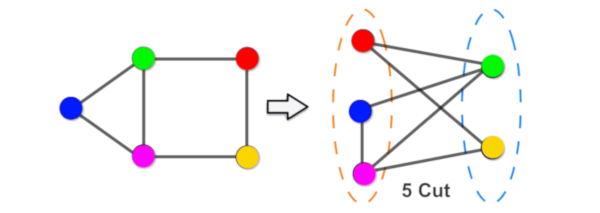
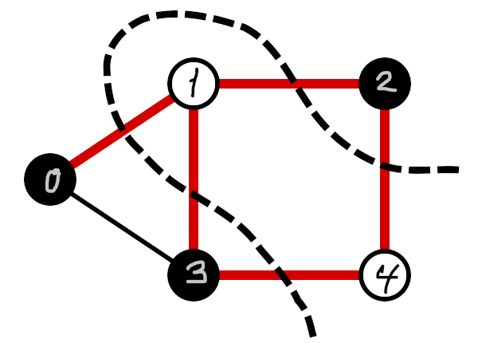

# D-Wave experiments
**Continuous Integration:**   
**Static Analysis & coverage:** 

This repository implements some of the examples given in "Quantum Bridge Analytics I: A Tutorial on Formulating and Using QUBO Models" by Glover et al. [1]. It should be noted that [1] operates with symmetric QUBO matrices while the D-Wave [binary quadratic model](https://docs.ocean.dwavesys.com/en/stable/concepts/bqm.html) represents the QUBO variables as an upper-diagonal/upper-triangular matrix. A symmetric matrix <i>Q</i> is easily transformed to upper-diagonal form by replacing  <i>qij</i> with <i>qij + qji</i>, for all <i>i</i> and <i>j</i> with <i>j > i</i>. All <i>qij</i> with <i>j < i</i> are replaced by <i>0</i>. So we are just doubling all values above the main diagonal (as the matrix is symmetric) and setting all values below the main diagonal to <i>0</i> 

## The number partitioning problem

The variant of the number partitioning problem we look at here involves partitioning a set of numbers into two subsets such that the subset sums are as close to each other as possible. The formulation of the binary quadratic model is based on the QUBO optimization problem described in [1]. You can find more background on the hardness of the problem in [2].

Consider a set of numbers <i>S = {s1, s2, ..., sn}</i> and let <i>xi = 1</i> if <i>si</i> is assigned to subset 1; <i>0</i> otherwise. The sum for subset 1 is then given by <i>sum1 = &Sigma;sixi, 1&le;i&le;n</i>, and the sum for subset 2 is given by <i>sum2 = &Sigma;si - &Sigma;sixi, 1&le;i&le;n</i>.

The difference in the sums is then <i>diff = &Sigma;si - 2&Sigma;sixi = c - 2&Sigma;sixi, 1&le;i&le;n</i>. (where <i>c</i> denotes the (constant) sum of all the numbers in the set).

The difference is minimized by minimizing:
<i>diff2 = (c - 2&Sigma;sixi)2, 1&le;i&le;n = xTQx</i>

Where <i>x</i> is the (<i>n</i>-)vector deciding whether a given number belongs to set 1 or set 2, and <i>Q</i> is a symmetric <i>n X n</i> matrix where <i>qii = si(si - c)</i> and <i>qij = qji = sisj</i> (to convince myself I scribbled down the [math](readme/math/number_partitioning_problem.jpg) - note that <i>x = x2</i> as <i>x</i> either has the value <i>0</i> or <i>1</i>).

If you run the implementation given in `example_partition_problem.py` you should see the example set `s = [25, 7, 13, 31, 42, 17, 21, 10]` partitioned into either `s1 = [25, 7, 13, 17, 21]`
and `s2 = [31, 42, 10]`, or `s1 = [7, 13, 42, 21]` and `s2 = [25, 31, 17, 10]`. Both are perfect partitions.

## The maximum cut problem
The maximum cut for an unweighted undirected graph <i>G=(V, E)</i>, is defined as the problem of partitioning (cutting) the set of vertices <i>V</i> into two complementary subsets, <i>S</i> and <i>Sc</i>, such that the number of (cut) edges between <i>S</i> and <i>Sc</i> is as large as possible.

The maximum cut problem is known to be NP-complete. The weighted version of the problem constitutes the 21st of Karp's NP-complete problems [4]. And Hohmann and Kern showed in [5] that, given a graph and a cut, deciding whether or not the given cut is maximal is as hard as solving the maximum cut problem - so there's no feasible way of verifying our results.

Below a maximum cut is illustrated for a simple graph of 5 vertices (nodes) and 6 edges. The illustation is taken from [3] and the nodes have been "color coded" for clarity.

Exactly the same cut can also be illustrated as follows.

The problem can be modelled by introducing binary variables satisfying <i>xi = 1</i> if vertex <i>i</i> is in subset <i>S</i>, and <i>xi = 0</i> if <i>i &isin; Sc</i>. An edge is "severed" by the cut if one of its endpoints is in subset <i>S</i> while the other is in <i>Sc</i>. This implies that the quantity <i>(xi + xj - 2xixj)</i> can be used to decide if an edge <i>(i, j)</i> is part of the cut or not. If the edge <i>(i, j)</i> is part of the cut then exactly one of <i>xi</i> and <i>xj</i> equals <i>1</i> while the other is <i>0</i> - in this case <i>(xi + xj - 2xixj)</i> is equal to <i>1</i>. If <i>(i, j)</i> is not part of the cut, then both <i>xi</i> and <i>xj</i> have the value <i>1</i> or both are <i>0</i> - in both cases <i>(xi + xj - 2xixj)</i> is equal to <i>0</i>.

Thus the problem of maximizing the number of edges in the cut can be formulated as:

<i>maximize(&Sigma; xi + xj - 2xixj, (i, j)&in; E)</i> (the sum is over all edges in the graph)

Since the D-Wave system is a "minimizing sort of creature" we need to reformulate the expression as a minimization problem. This is done by multiplying the expression by -1; i.e. we need to solve the following to find the maximum cut:

<i>minimize(&Sigma; -xi - xj + 2xixj, (i, j)&in; E)</i>

This is an instance of:

<i>minimize(xTQx</i>)</i>

Where <i>x</i> is the (<i>n</i>-)vector deciding whether a given node belongs to <i>S</i> or <i>Sc</i>, and <i>Q</i> is a symmetric <i>n X n</i> matrix where <i>qii = -(|(&bull;, i) &in; E| + |(i, &bull;) &in; E|)</i> (i.e. the total number of edges having an endpoint in node <i>i</i>, negated) and <i>qij = qji = 1</i>.

An example of the QUBO formulation of the maximum cut for a graph can be found [here](readme/math/maximum_cut.jpg).

## References
(in no particular order - just added on the go)

[1] Fred Glover, Gary Kochenberger, Yu Du (2019), "Quantum Bridge Analytics I: A Tutorial on Formulating and Using QUBO Models",
[arXiv:1811.11538](https://arxiv.org/abs/1811.11538)

[2] Stephan Mertens (2003), "The Easiest Hard Problem: Number Partitioning", [arXiv:cond-mat/0310317](https://arxiv.org/abs/cond-mat/0310317)

[3] Abhijith et al. (2020), "Quantum Algorithm Implementations for Beginners", [arXiv:1804.03719](https://arxiv.org/abs/1804.03719)

[4]  Karp, R. M. (1972), "Reducibility among combinatorial problems", in Miller, R. E.; Thatcher, J. W. (eds.), Complexity of Computer Computations, New York: Plenum Press, pp. 85–103.

[5] Hohmann, C., Kern, W. (1990), "Optimization and optimality test for the Max-Cut Problem.", [ZOR - Methods and Models of Operations Research 34, 195–206](https://research.utwente.nl/en/publications/optimization-and-optimality-test-for-the-max-cut-problem)